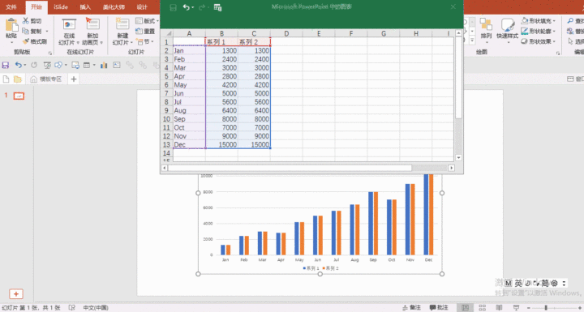
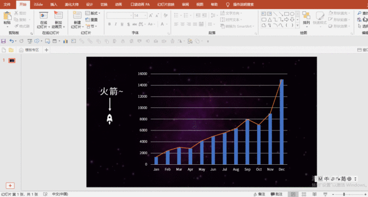
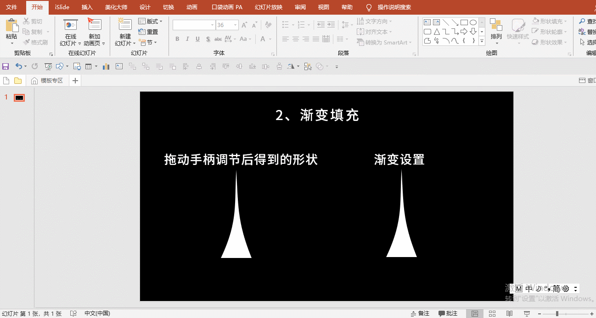
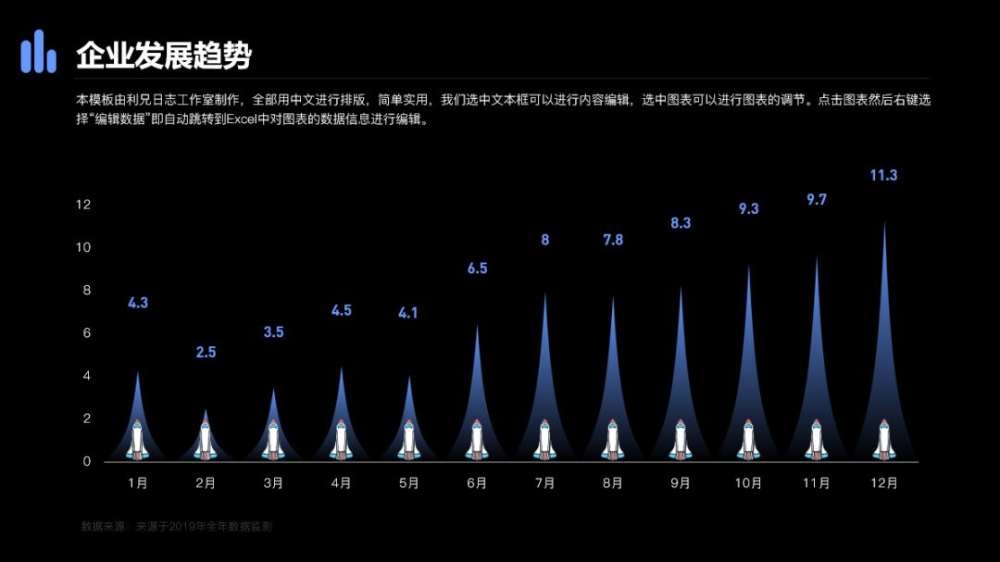
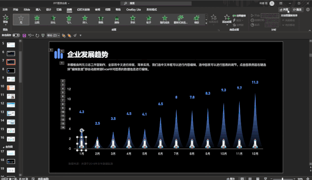

# ✨火箭动图

首先输入两列**相等的数据**，然后更改图表类型时，**一个为柱形图**，**另一个为折线图**，勾选其中一个为**次坐标轴**，确保两个纵坐标轴的**数据范围一致**后，删除其中一个纵坐标轴：

为了后面效果明显，我先把图片背景加上，网格线的设置可以通过选中网格线——右键设置网格线格式中，调整其透明度；接着将火箭图标**复制粘贴**到**折线图的标记点**，并选中折线图，设置**形状轮廓为无**，就可以把折线去掉，完成折线图的美化：

接下来是柱形图的美化，这里绘制形状稍微有些耗时，通过**三角形编辑顶点+渐变填充**得到：

调节好后进行**渐变填充**：
选中形状右键——设置形状格式——渐变填充——类型为「线性」，角度「90°」，设置两个都为白色的光圈，前一个透明度0%，后一个100%：

现在可以对柱形复制粘贴啦，

利用上面的数据可以制作动态的火箭图

**设置图表的动画**

接下来，我们需要给这个图表添加一个**擦除动画**，动画的效果选项里面，方向我们选择**自底部**，序列我们选择**按类别中的元素**

插入素材，组合动画

我们插入一个火箭的PNG素材，复制多个，在每个数据系列中摆放位置。

接下来，我们设置每一个火箭素材的动画为**路径动画**，**方向是向上**，距离根据图表的高度进行调整。

这一步需要挨个去调整。

接下来，我们要做就是调整每一个动画的出现时机，我们火箭飞出去的时候，下面的图表也要立马出现。

所以每一个系列的图表动画应该与火箭上升的动画同时。而下一个系列应该在前一个之后。

可以看一下动画窗格。

这一步需要慢慢调，最后我们就可以得到这样一个图表动画。

## 参考

- <a href="https://mp.weixin.qq.com/s?__biz=MzIwNjEwNTEzNQ==&mid=2650078173&idx=1&sn=0a2f4eaa5b8a1f67729e1ce4a3223246&chksm=8f26e49db8516d8be92f725637c48d432885c10d2a95abe22c76cd3aea1fd2020f366a19f484&scene=21#wechat_redirect" target="_blank">这3个酷炫的PPT图表，一般人真不会！</a> 