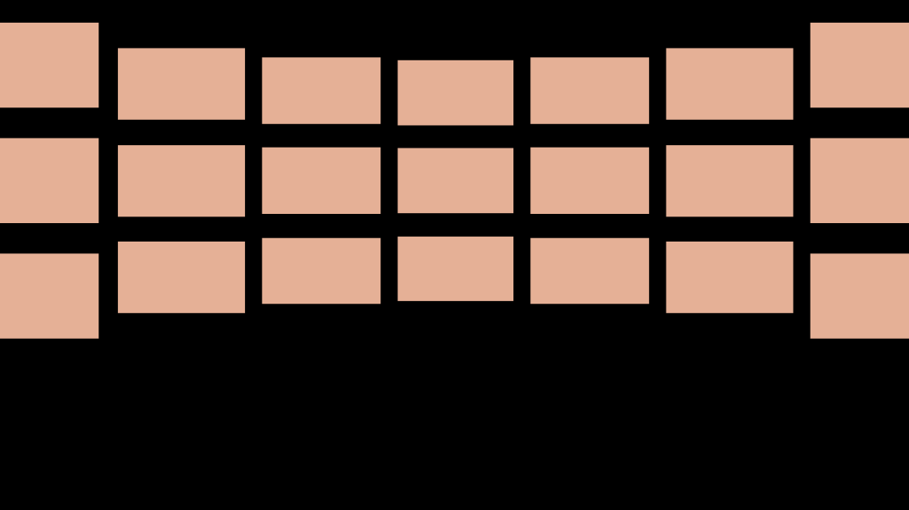

# ✨舞台曲面屏PPT封面

那么，**图片巨多的PPT要怎么排版呢？**

这里我分享一种思路：**做成电影墙的展示效果。**

很简单，分为三步走：

**1）制作三维效果的形状；**

**2）将图片填充到形状里去；**

**3）美化背景；**

## **制作三维效果的形状**

首先我们插入一个矩形，参考大小是3.18厘米*5.65厘米。

然后水平复制成一个7*3的矩形方阵，有两种方法，第一种是按住ctrl+shift，鼠标拖动复制。

另一种，是借助插件iSlide-设计排版-矩形布局功能，设置几个参数就可以一键生成。

矩形方阵复制出来后，为了方便后边调整，我们将每一竖直方向的矩形，都单独组合起来，也就是一列一组。

这一步很重要，没有组合的话，后边一个个参数的设置会做到你哭。

为了电影墙的效果更加细腻，这时候将靠近中间的矩形渐渐缩小，设置方法以及各列矩阵参数如下：

设置方法：

参数如下：

统一缩小后，我们需要将矩阵对齐。按ctrl+A全选后，依次点击「格式」-「对齐」-「垂直居中」。

动图演示：

完成后效果是这样：

可以看到，基本感觉已经出来了，接下来，就是对竖直矩形做三维旋转效果，也不麻烦，调节X轴旋转和透视两个参数即可。

具体操作：

各个矩阵的参数如下：

这时候，主体效果已经出来了，在我们的精雕细琢之下，矩阵的上下边缘，已经很明显地有了弧度。

## **把图片填充到形状里去**

把我们的图片分别填充到形状里去，整个版面就非常好看了！

怎么把图片填充到形状里去？

很简单，右击形状，点击【设置形状格式】-【填充】-【图片或纹理填充】-【插入】-从电脑中选中图片即可。

接着，我们把文字主体放上去，分别是logo、标题和装饰性英文。中文标题与英文装饰都是思源宋体。

## **美化背景**

做完上面的步骤，你可以看到整体效果已经7788了。唯一美中不足的是，页面下方会有点空，只有孤零零的两行文字，显得有些单调。

因此我们可以试着对底下空荡荡的背景做点美化，比如添加装饰。

说到加装饰，最简单的方法，就是找张合适图片叠下去。

比如下面这张科技感图片，图片的下半部分，是向中心放射聚拢的线条，刚好很适合作为上边案例的装饰。

但是呢，图片是蓝色的，与我们案例主题不契合，因此不能直接用，需要稍微处理一下。

首先我们需要为图片做去色处理，选中图片以后点击【格式】-【颜色】-选择【饱和度】为0：

选中图片，点击【格式】-【校正】-选择一种差不多的图片亮度即可：

由于原案例上半部分是电影墙，从视觉效果上看起来已经很饱满了，所以我们只取图片的下半部分就好，右击图片点击【裁剪】，保留需要的部分即可：

裁剪后放到原本的电影墙图片底部，大功告成！

## 参考

- <a href="https://mp.weixin.qq.com/s?__biz=MzI4MDAzMTQ4NA==&mid=2650376696&idx=1&sn=3bdfb467befee4f9457078d12278904d&chksm=f3b3906bc4c4197d9037fb13ff7c2e59befdc87f2314da18d03be4751b0e990d9245dda068f3&mpshare=1&scene=1&srcid=0722ydCO9YF49zhogoQAepbi&sharer_sharetime=1595431782354&sharer_shareid=a49666cf2c8d2905df9b2c542be3e8aa&key=942f56af7a259eb0edf23bf95020b0cfb6fce6014f8ac87e7816b85ab01b3a3f08722a9a6bbda956da5fe38d786c62c9c2a9d03ca3289465de97c46f05940889df86bd8d78fbeccf6591f0f51b9575dd&ascene=1&uin=MzgxMzU5NzQ4&devicetype=Windows+10+x64&version=62090070&lang=zh_CN&exportkey=A0lgNw%2Fiiixk2tLDx9Gv2Eg%3D&pass_ticket=ESqyxwn8xuGQjkDbdIg%2F8tp5fNnCq39JA6Z0ugdT%2B3odJ1WsLRFeNApeaG%2Bqq4js" target="_blank">图片巨多的PPT怎么排版？分享给你一个高逼格的解决思路！</a> 
- B 站<a href="https://www.bilibili.com/video/BV1Ce411s776?p=2" target="_blank">PPT图片处理的二十种技巧系列【用PPT来"P"图】</a>  

