# ✨创意表格制作

**美化表格01**

1、插入表格，录入内容以后，我们进入「设计」-「变体」-「颜色」中将表格主题颜色设为「灰度」。然后进入「表格工具」-「设计」-「表格样式」选择一种自己喜欢的样式。

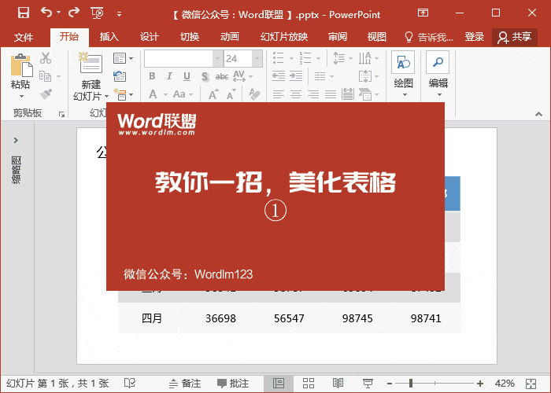

2、选中其中某列，然后复制，粘贴。我们将复制出来的这一列，移动到表格中所在位置，按住Ctrl不松，用鼠标左键将其稍微放大一点。最后修改「底纹颜色」，取消「边框」。

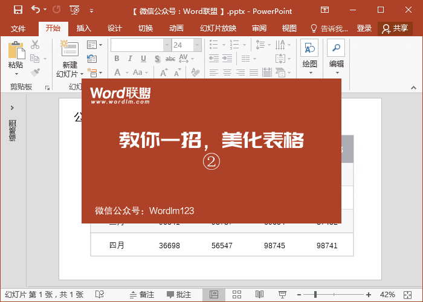

3、进入「表格工具」-「设计」-「表格样式」-「效果」-「阴影」-「外部」-「居中偏移」添加一个外部阴影。

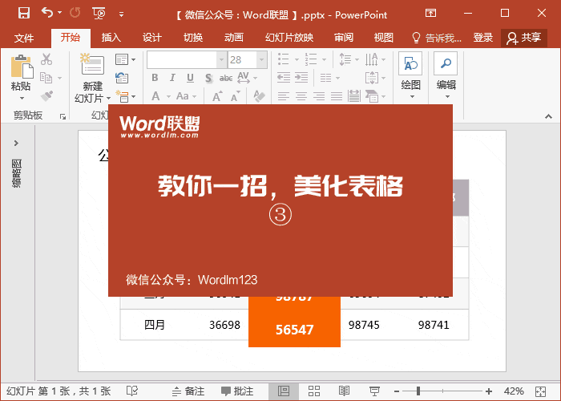

当然，你也可以将中间突显的列换为行。

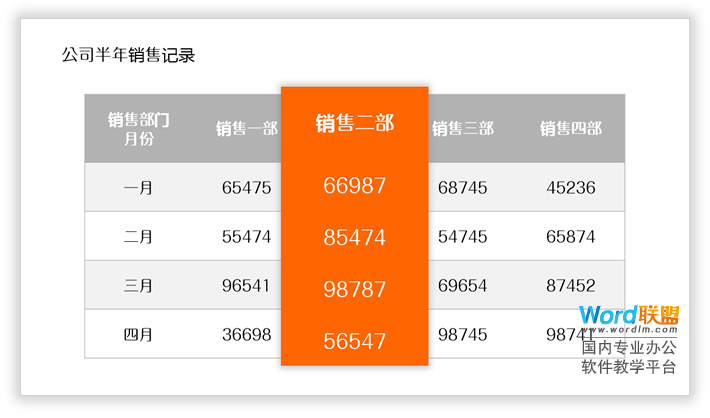

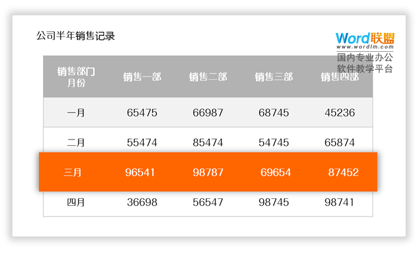

美化表格02

1、将表格底纹颜色设为灰色，然后取消边框线条。

2、将标题部分字号加大，然后稍微调整一下表格大小。

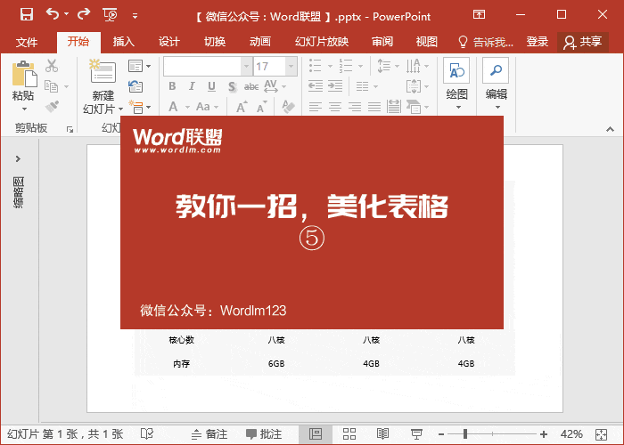

3、复制，粘贴其中一列，然后拖到表格中所在位置对齐，按住Ctrl键不放，用鼠标左键放大一些。

4、给突出显示这一列换上白色，然后加上外部阴影。

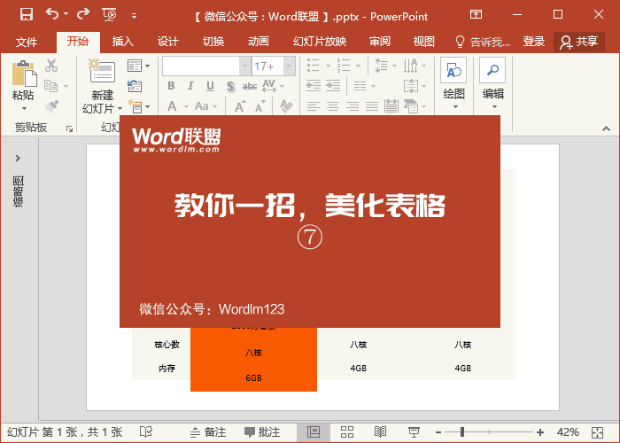

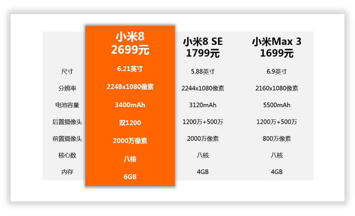

复制四个页面，为每列做同样的效果。

播放效果。

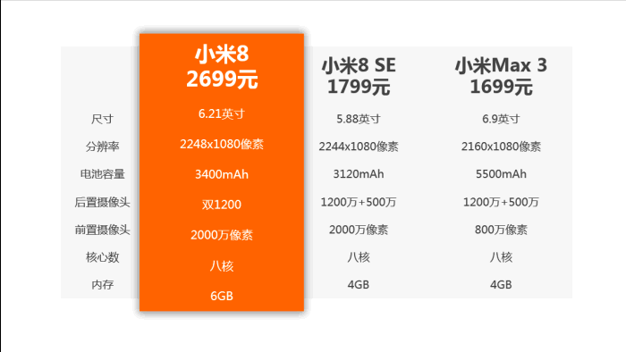

当然，教大家的是方法，怎么运用还是要靠大家自己了。除此之外，我们还能够利用该方法衍生出各种好看的表格。

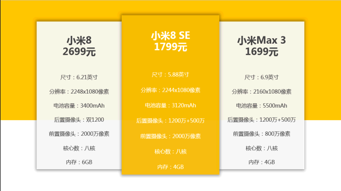

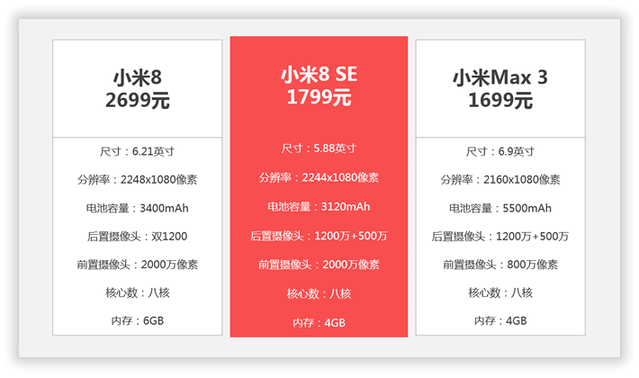

## 参考

- 操作：<a href="http://www.wordlm.com/PowerPoint/qmxppt/6671.html" target="_balnk">「PPT美化表格」教你一招，美化表格，让你的表格瞬间高大上</a>   